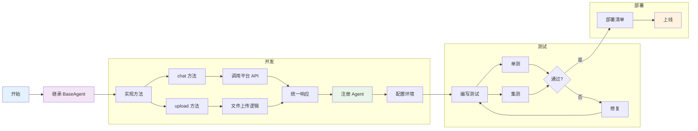

## 开发概述

AI Gateway 采用插件化架构设计，支持轻松扩展新的AI平台。通过实现标准的BaseAgent接口，您可以快速集成任何AI服务。

## 流程展示



## 开发步骤

### 1. 继承BaseAgent基类

所有Agent都必须继承自BaseAgent抽象基类：

```python
from abc import ABC, abstractmethod
from typing import Dict, Any
from fastapi import UploadFile

class BaseAgent(ABC):
    @abstractmethod
    async def chat(self, request: ChatRequest) -> UnifiedChatResponse:
        pass
    
    @abstractmethod
    async def upload_file(self, file: UploadFile, created_by: str) -> FileResponse:
        pass
```

### 2. 实现核心方法

创建新的Agent类并实现必要的方法：

```python
class NewPlatformAgent(BaseAgent):
    def __init__(self, config: Dict[str, Any]):
        self.config = config
        self._validate_config()
    
    async def chat(self, request: ChatRequest) -> UnifiedChatResponse:
        # 1. 转换请求格式
        platform_request = self._convert_request(request)
        
        # 2. 调用平台API
        response = await self._call_platform_api(platform_request)
        
        # 3. 转换响应格式
        return self.format_response(response)
    
    async def upload_file(self, file: UploadFile, created_by: str) -> FileResponse:
        # 实现文件上传逻辑
        pass
```

### 3. 注册Agent

将新Agent注册到注册表中：

```python
from .registry import registry

def register_new_platform_agent():
    config = {
        "base_url": os.getenv("NEW_PLATFORM_BASE_URL"),
        "api_key": os.getenv("NEW_PLATFORM_API_KEY")
    }
    
    if config["base_url"] and config["api_key"]:
        agent = NewPlatformAgent(config)
        registry.register("new_platform", agent)

# 自动注册
register_new_platform_agent()
```

### 4. 配置环境变量

在 `.env` 文件中添加配置：

```bash
NEW_PLATFORM_BASE_URL=https://api.newplatform.com
NEW_PLATFORM_API_KEY=your-api-key
```

## 关键实现要点

### 请求格式转换

将统一的请求格式转换为平台特定格式：

```python
def _convert_request(self, request: ChatRequest) -> Dict[str, Any]:
    return {
        "message": request.query,
        "user_id": request.user,
        "stream": request.stream
    }
```

### 响应格式转换

将平台响应转换为统一格式：

```python
def format_response(self, response: Any) -> UnifiedChatResponse:
    return UnifiedChatResponse(
        id=response.get("id"),
        model=response.get("model"),
        usage=response.get("usage"),
        choices=response.get("choices", [])
    )
```

### 错误处理

实现完善的错误处理：

```python
async def chat(self, request: ChatRequest) -> UnifiedChatResponse:
    try:
        # 实现聊天逻辑
        pass
    except Exception as e:
        logger.error(f"Chat error: {e}")
        raise HTTPException(status_code=500, detail="Internal error")
```

## 测试验证

### 单元测试

```python
def test_config_validation(self):
    """测试配置验证"""
    with pytest.raises(ValueError):
        NewPlatformAgent({})

async def test_chat(self):
    """测试聊天功能"""
    request = ChatRequest(query="Hello", user="test_user")
    response = await self.agent.chat(request)
    assert response.id is not None
```

### 集成测试

```python
async def test_api_integration():
    """测试API集成"""
    response = await client.post(
        "/api/v1/chat",
        headers={"agent": "new_platform"},
        json={"query": "Hello", "user": "test_user"}
    )
    assert response.status_code == 200
```

## 部署检查清单

- [ ] 代码符合PEP 8规范
- [ ] 包含完整的类型注解
- [ ] 有充分的错误处理
- [ ] 包含单元测试
- [ ] 环境变量配置正确
- [ ] 在测试环境验证通过

<Card
  title="查看完整示例"
  icon="code"
  href="/essentials/agent-example"
>
  查看完整的Agent开发示例代码
</Card>
