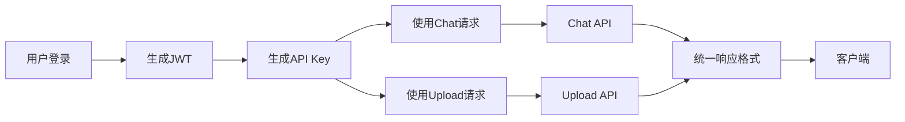

## 概述

AI Gateway平台支持两种认证方式：
1. **JWT令牌认证** - 适用于用户登录和API Key管理
2. **API Key认证** - 适用于长期API访问，无需担心过期和刷新

## 业务流程

### 标准API访问流程

### 详细步骤
1. **用户登录** (`POST /api/v1/auth/login`)
   - 使用用户名和密码登录
   - 获取JWT访问令牌

2. **创建API Key** (`POST /api/v1/api-keys/`)
   - 使用JWT令牌认证
   - 设置API Key名称、描述、过期时间等
   - 获取完整的API Key

3. **使用API Key访问API**
   - 聊天接口：`POST /api/v1/chat`
   - 文件上传：`POST /api/v1/upload`
   - 在请求头中使用 `Authorization: Bearer YOUR_API_KEY`

## API Key 特性

### 安全特性
- 使用SHA-256哈希存储，即使数据库泄露也无法还原原始密钥
- 支持设置过期时间，可自动失效
- 支持权限控制，可限制API Key的访问范围
- 支持撤销功能，可立即停用而不删除

### 使用统计
- 记录总调用次数
- 记录今日和本月调用次数
- 记录最后使用时间
- 支持按时间段重置计数

### 权限控制
- 只有**管理员**和**高级用户**可以创建API Key
- 用户只能管理自己创建的API Key
- 管理员可以查看和管理所有API Key

## 创建API Key

### 权限要求
- 用户角色必须是 `admin` 或 `premium`
- 需要有效的JWT令牌